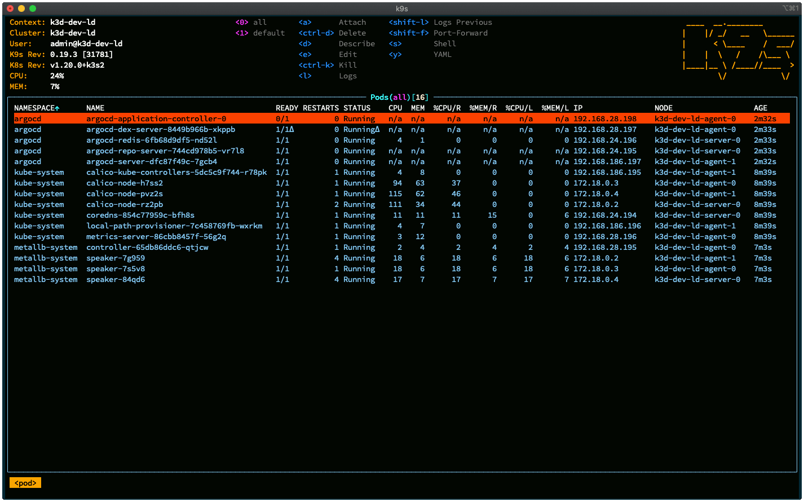
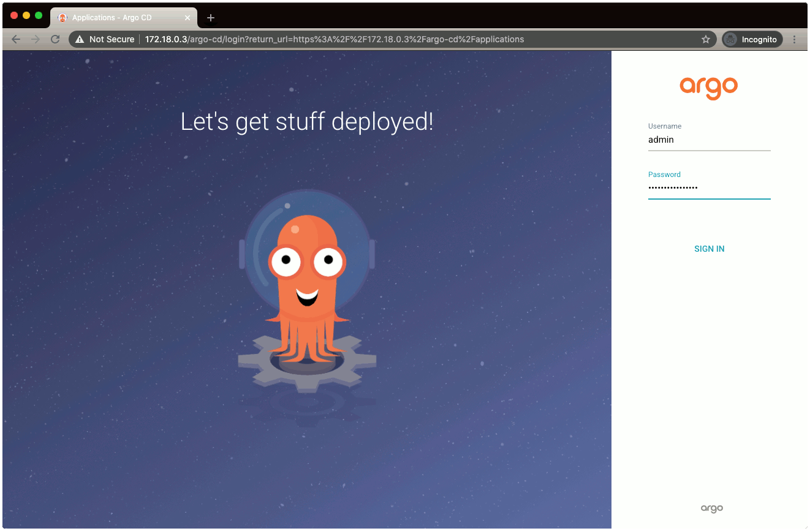
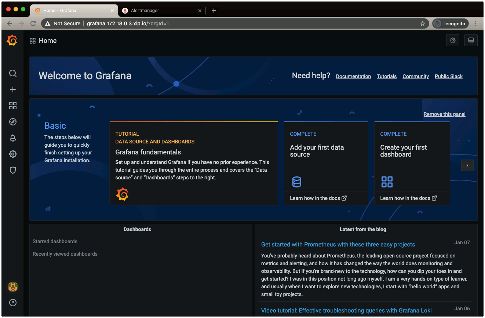

# k3s-argocd-bootstrap
bootstrapping K3S/K8S using ArgoCD
Inspired by the postings in the references section.

## Prerequisites
* [K3D](https://k3d.io/): k3d is a lightweight wrapper to run k3s (Rancher Lab’s minimal Kubernetes distribution) in docker.
* [kubectl](https://kubernetes.io/docs/reference/kubectl/overview/): The kubectl command line tool lets you control Kubernetes clusters. 
* [kustomize](https://kustomize.io/): Kustomize introduces a template-free way to customize application configuration that simplifies the use of off-the-shelf applications.
* K9S CLI(https://k9scli.io/): K9s is a terminal based UI to interact with your Kubernetes clusters.
* [xip.io](http://xip.io/): xip.io is a magic domain name that provides wildcard DNS.

## Follow
```
└── K3D ──> MetalLB ──> Deploy ArgoCD using Kustomize
                        ├──> Deploy ArgoCD
                        └──> Deploy ArgoCD APP - bootstrap-cluster Helm chart
                             ├──> Deploy namespace.yaml
                             ├──> Deploy ArgoCD APP - ingress-nginx-app Helm chart
                             ├──> Deploy ArgoCD APP - cert-manager-app Helm chart
                             │    ├──> Deploy cert-manager
                             │    └──> Create letsencrypt cluster issuer
                             ├──> Deploy ArgoCD APP - k8s-config-app Helm chart
                             ├──> Deploy ArgoCD APP - argocd-ingress-app Helm chart
                             └──> Deploy ArgoCD APP - kube-prometheus-stack-app Helm chart
```

## How to Run
### Configure K3S
1. Provision K3S cluster
```
make provision-dev-cluster
```
2. Install metallb
```
make install-metallb
```
3. Configure tuntap

Mac only
```
make configure-tuntap
```
4. argocd-bootstrap

Run one more time if it fails with the below error.
> error: unable to recognize "STDIN": no matches for kind "Application" in version "argoproj.io/v1alpha1"
```
make argocd-bootstrap
```
5. Monitor using K9S
```
k9s
```


### ArgoCD
1. Set a temporary argocd password
```
make set-argocd-password
```
2. Check Ingress
```
❯ kubectl -n argocd get ingress

NAME                    CLASS    HOSTS   ADDRESS      PORTS   AGE
argocd-server-ingress   <none>   *       172.18.0.3   80      158m
```
3. Log into argocd UI
Open web browser and type <argocd ingress address>/argo-cd
```
172.18.0.3/argo-cd
```


### Prometheus
1. Check Ingress

I registered 172.18.0.3 and 172.18.0.4 since external IP of metallb is one of them most of the time.
```
❯ kubectl -n monitoring get ingress

NAME                                 CLASS    HOSTS                                                           ADDRESS      PORTS   AGE
kube-prometheus-stack-alertmanager   <none>   alertmanager.172.18.0.3.xip.io,alertmanager.172.18.0.4.xip.io   172.18.0.3   80      37m
kube-prometheus-stack-grafana        <none>   grafana.172.18.0.3.xip.io,grafana.172.18.0.4.xip.io             172.18.0.3   80      37m
kube-prometheus-stack-prometheus     <none>   prometheus.172.18.0.3.xip.io,prometheus.172.18.0.4.xip.io       172.18.0.3   80      105s
```
2. Log into UI
Open web browser and type
* alertmanager.172.18.0.3.xip.io
* grafana.172.18.0.3.xip.io
* prometheus.172.18.0.3.xip.io


## How to cleanup
```
make cleanup
```

# References
* [Bootstrap a kubernetes cluster with ArgoCD and Istio](https://nemo83.dev/posts/argocd-istio-operator-bootstrap/)
* [Bootstrapping Kubernetes with ArgoCD](https://alexsimonjones.medium.com/bootstrapping-kubernetes-with-argocd-989f27ae475)
* [mikesparr/multi-cluster-argo-demo](https://github.com/mikesparr/multi-cluster-argo-demo)
* [K3s with k3d and MetalLB](https://blog.kubernauts.io/k3s-with-k3d-and-metallb-on-mac-923a3255c36e)
* [AlmirKadric-Published/docker-tuntap-osx](https://github.com/AlmirKadric-Published/docker-tuntap-osx)
* [Installing Ambassador, ArgoCD, and Tekton on Kubernetes](https://medium.com/dzerolabs/installing-ambassador-argocd-and-tekton-on-kubernetes-540aacc983b9)
* [Helm from basics to advanced](https://banzaicloud.com/blog/creating-helm-charts/)
